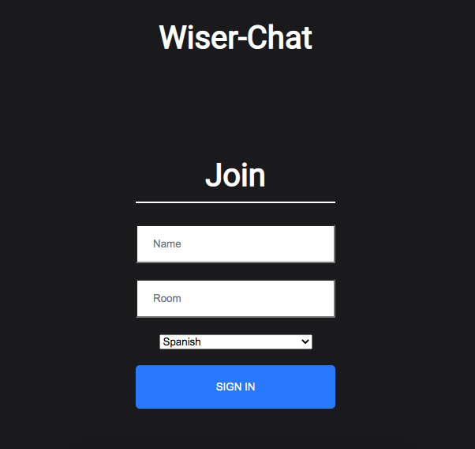

# Wiser-Chat



> This is a realtime chat application that uses React on the front end, with Express JS, NodeJS and Socket.io web socket library on the back end. The project also uses the Google Cloud Translation Api for a realtime translation of the current chatroom. 

---

### Table of Contents

- [Description](#description)
- [How To Use](#how-to-use)
- [References](#references)
- [License](#license)
- [Author Info](#author-info)

---

## Description

In this application, your able to create a username, chatroom and translation language of choice. This is great application for sending messages to people who don't speak or write in the same language as you. On your end, you'll be able to translate a message the language of your choice, type in your language of choice and send. The receiving user will be able to translate your message and continue chatting with everyone in the chatroom without having to stop to understand what a user is trying to say.


### Technologies

- Node JS
- React JS
- Express JS
- Socket.io
- [Google Cloud Translation API](https://cloud.google.com/translate)
- [Netlify - FrontEnd Deployment](https://www.netlify.com/)
- [Heroku - BackEnd Deployment](https://www.heroku.com/home)

[Back To The Top](#Wiser-Chat)

---

## How To Use

- On the homepage, join a chat with a username, chat name and language translation (English will generate in translation if no language is set).
- Join!
- Ensure the other users you want to chat with enter the same chat name and begin to chat!


## Installation


OS:

- Front End - client directory
```sh
npx create-react-app [appName]
npm i --save react-router 
npm i react-router-dom 
npm i socket.io-client 
npm i moment --save
npm i react-scroll-to-bottom 
npm i react-emoji 
npm i query-string
```
- Back End - server directory
```sh
npm i cors
npm i nodemon
npm i express
npm i socket.io
npm i --save
```

#### API Reference

[Google Cloud Translate](https://www.npmjs.com/package/@google-cloud/translate)

```sh
npm i @google-cloud/translate
```

[Back To The Top](#Wise-Chat)


## References

[Build and Deploy a Realtime Chat Application](https://www.youtube.com/watch?v=ZwFA3YMfkoc)

[Google Cloud Translate API with NodeJS](https://www.youtube.com/watch?v=Sjl9ilOpHG8&t=581s)

## License

MIT License

Permission is hereby granted, free of charge, to any person obtaining a copy
of this software and associated documentation files (the "Software"), to deal
in the Software without restriction, including without limitation the rights
to use, copy, modify, merge, publish, distribute, sublicense, and/or sell
copies of the Software, and to permit persons to whom the Software is
furnished to do so, subject to the following conditions:

The above copyright notice and this permission notice shall be included in all
copies or substantial portions of the Software.

THE SOFTWARE IS PROVIDED "AS IS", WITHOUT WARRANTY OF ANY KIND, EXPRESS OR
IMPLIED, INCLUDING BUT NOT LIMITED TO THE WARRANTIES OF MERCHANTABILITY,
FITNESS FOR A PARTICULAR PURPOSE AND NONINFRINGEMENT. IN NO EVENT SHALL THE
AUTHORS OR COPYRIGHT HOLDERS BE LIABLE FOR ANY CLAIM, DAMAGES OR OTHER
LIABILITY, WHETHER IN AN ACTION OF CONTRACT, TORT OR OTHERWISE, ARISING FROM,
OUT OF OR IN CONNECTION WITH THE SOFTWARE OR THE USE OR OTHER DEALINGS IN THE
SOFTWARE.

[Back To The Top](#Wiser-Chat)

## Author Info

- Website - [AndresIcedo.com](https://AndresIcedo.com/)
- LinkedIn - [andres-icedo](https://www.linkedin.com/in/andres-icedo/)
- GitHub - [andresicedo](https://github.com/andresicedo)


[Back To The Top](#Wiser-Chat)
